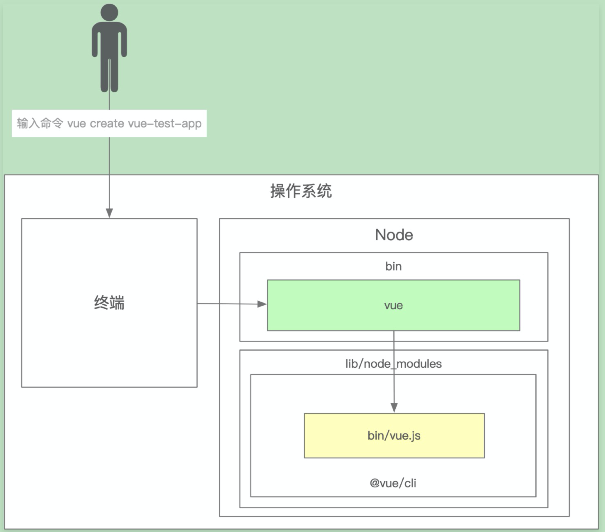

<!--
 * @Author       : joker_yjc
 * @Date         : 2021-01-07 11:23:42
 * @LastEditors  : joker_yjc
 * @LastEditTime : 2021-01-07 17:28:21
 * @Desciption   :
-->

# 课程标题名称——02-脚手架架构设计和框架搭建

## 从 vue create vue-test-app 了解脚手架运行原理



- 在终端输入 `vue create vue-test-app`
- 终端解析出 `vue` 命令
- 终端在环境变量中找到 `vue` 命令
- 终端根据 `vue` 命令链接到实际文件 `vue.js`
- 终端利用 `node` 执行 `vue.js`
- `vue.js` 解析 command / options
- `vue.js` 执行 command
- 执行完毕，退出执行

## linux 创建连接命令 ln -s 创建软连接

ln -s 是 linux 中一个非常重要命令。它的功能是为某一个文件在另外一个位置建立一个同不的链接，这个命令最常用的参数是-s。

- 具体用法是：ln -s 源文件 目标文件。

```
ln -s /bin/less /usr/local/bin/less
```

- -s 是代号（symbolic）的意思。
  这里有两点要注意：
  第一 ln 命令会保持每一处链接文件的同步性，也就是说，不论你改动了哪一处，其它的文件都会发生相同的变化；
  第二 ln 的链接有软链接 和硬链接
  两种，软链接就是
  ln -s \*\* **,它只会在你选定的位置上生成一个文件的镜像，不会占用磁盘空间，硬链接 ln ** \*\*,没有参数-s, 它会在你选定的位置上生成一个和源文件大小相同的文件，无论是软链接还
  是硬链接，文件都保持同步变化。

## 使用 npm link 调试本地未发布的 npm 包

```
  cd project-dir
  npm link
```

`npm link`：将当前项目链接到 `node` 全局 `node_modules` 中作为一个库文件，并解析 `bin` 配置创建可执行文件
引用本地需要调试的项目，使用`npm link project-name`,并在`package.json`文件中添加该依赖

```
npm unlink project-name
```

`npm unlink`：将当前项目从`node`全局`node_modules`中移除
`npm unlink your-lib`：将当前项目中的库文件依赖移除
